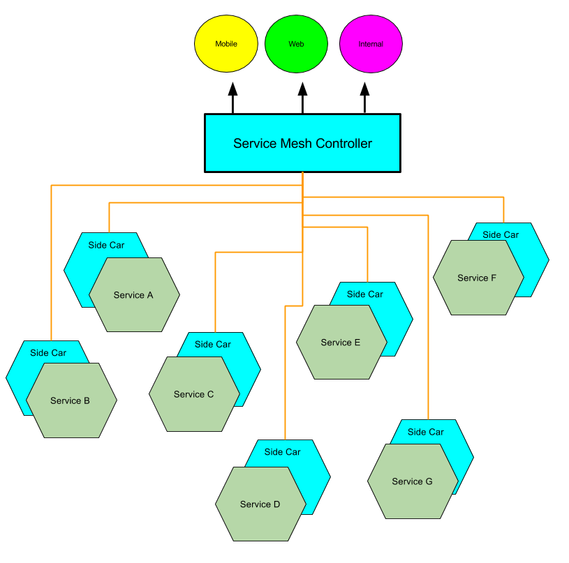
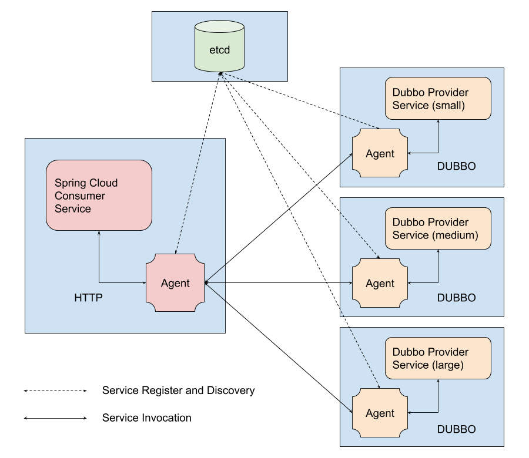
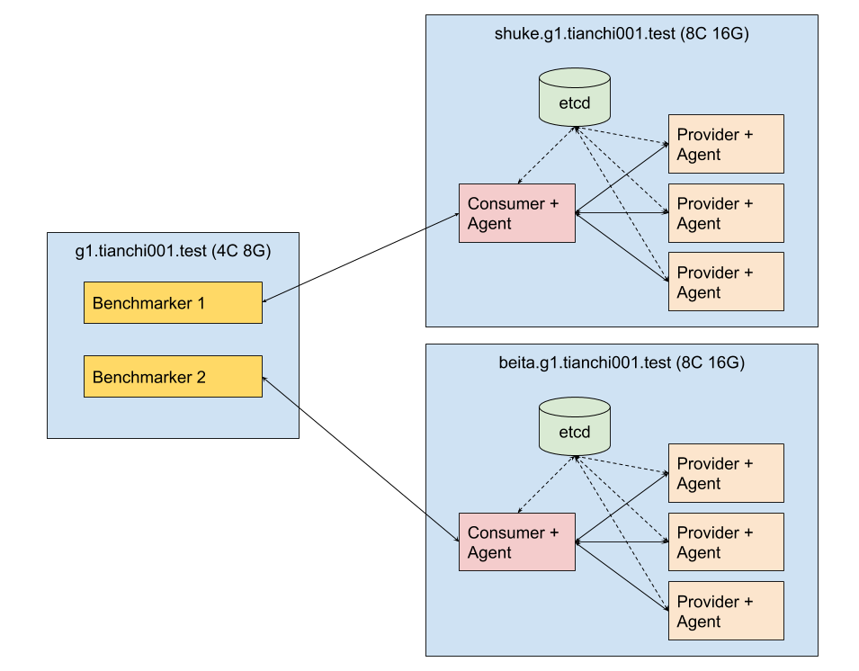
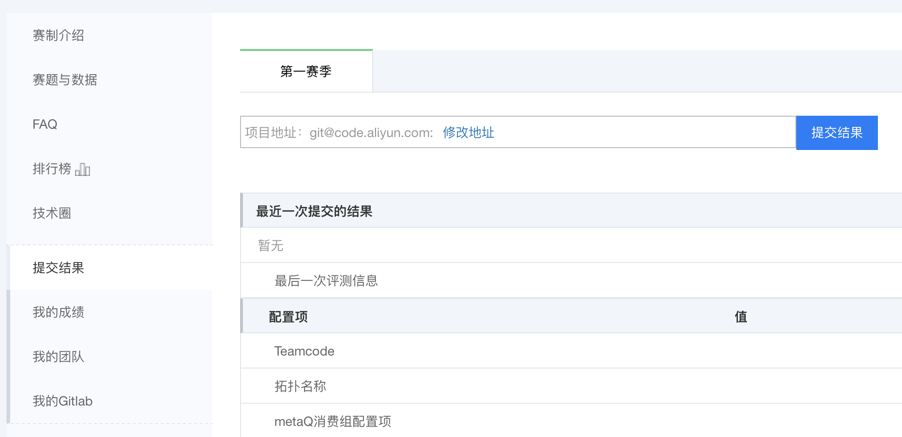

# 第四届阿里中间件性能挑战赛（初赛）

## 更新记录

### 【2018-05-17】Docker 容器以网桥形式启动

出于安全性考虑，现将所有 Docker 容器以网桥的形式启动。

在 benchmarker 脚本中，创建了一个名为 benchmarker 的网络，并分配地址段为 `10.10.10.0/24`，后续启动的 Docker 容器均在此网络内部运行。此番改动可以带来如下一些好处：

1. etcd 服务以容器的形式启动，不需要在宿主机上再部署 etcd 服务了
2. Docker 自定义网络有内建的 DNS 功能，因此容器之间可以通过 `etcd`、`consumer`、`provider-small`、`provider-medium` 和 `provider-large` 等域名的形式访问各个服务，不用再去寻找 `docker0` 网卡上的 IP 地址了
3. nc/ncat 检测服务端口是否可用的逻辑也通过一个容器来完成，避免了 nc/ncat 命令不存在，或版本不兼容引发的问题
4. 不需要将所有服务的端口都暴露给宿主机，只要将最终用于压测的 Consumer 服务的端口暴露出来可以了。避免引入大量不必要的端口，端口与文档可以保持较好的一致性，见下表：

| 服务 | 容器主机名 | 端口 | 备注 |
| ---- | ---- | ---- | ---- |
| etcd | etcd | 2379 | |
| Consumer | consumer | 8087 | 映射到宿主机的时候变为 80 |
| Consumer Agent | consumer | 20000 | |
| Provider Agent (small) | provider-small | 30000 | |
| Provider Agent (medium) | provider-medium | 30000 | |
| Provider Agent (large) | provider-large | 30000 | |
| Provider (small) | provider-small | 20880 | |
| Provider (medium) | provider-medium | 20880 | |
| Provider (large) | provider-large | 20880 | |

可能对现有 Agent 的实现产生的影响如下：

1. 访问方式上的变化。以前是通过 `docker0` 网卡获取 IP 地址，现在可以直接使用域名
2. 以前需要暴露的大量不同端口也尽量使用服务默认的端口
3. 对服务注册和发现有一定的影响（这个主要取决于服务注册与发现功能实现的是否足够通用）
4. Provider Agent 访问 Provider 的时候需要指定的连接信息发生了变化，如果是以配置文件的形式（就像 demo 那样）来实现的，则只需要修改配置信息即可
5. `bootstrap_samples.conf` 文件修改了，需要替换原来的 `bootstrap.conf` 文件，并填充留空的字段

### 【2018-05-15】Consumer 改为双异步

使用了 Servlet 3.0 异步 API 和 AsyncHttpClient 对 Consumer 进行改造，大幅提升了 Consumer 的性能。

## 〇、相关澄清（不定期更新）

**1、关于宣传文章中“使用缓存”的澄清。**

在宣传文章的第四章第 3 小节中说到：使用缓存。合理缓存响应结果，当相同的请求再次到来的时候，调用链可以不必经过系统中的每一个节点，从而尽快返回。

这里澄清一下缓存使用的范围：

1. 可以缓存 etcd 注册中心里的数据，及其他配置数据
2. 不可以对请求的数据流进行缓存
3. 不可以对返回结果进行缓存

## 一、赛题背景

### 1.1、Apache Dubbo (incubating) 简介


Apache Dubbo (incubating) 是阿里巴巴中间件团队开源的一款高性能 Java RPC 通讯框架。在分布式应用场景下，服务间通讯是非常重要的能力，通常由服务提供者暴露服务，由服务消费者调用服务。在 Dubbo 服务整合能力的支持下，使用 RPC 可以像使用本地调用一样轻松、便捷。但是在异常复杂的系统环境下，服务间调用也会变得非常复杂，如果没有一套完善的、经过大规模生产环境验证的服务治理能力的话，系统将会处于非常危险的境地。因此，从另一个方面来讲，Dubbo 不只是单纯的服务通讯框架，更是一套完备的服务治理框架。

有关 Dubbo 的更详细介绍，请登录[官方网站](http://dubbo.apache.org/)。

### 1.2、Service Mesh 简介



提到服务治理能力就不能不说一下微服务。微服务不光是创造性的将曾经的单体系统拆分为若干个独立的微服务系统，更重要的是其为这些服务的和谐运行提供了最佳实践和解决方案。服务注册、服务发现、服务治理、负载均衡、服务监控、流量管控、服务降级、服务熔断和服务安全等等，这些能力都是一个可用和可靠的微服务系统所不可或缺的。微服务的一大问题在于改造过程必须深入服务内部，拿使用 Dubbo 来说，所有接入的微服务系统都必须引入 Dubbo 组件，并暴露或消费相关的服务。

而 Service Mesh 则另辟蹊径，其实现服务治理的过程不需要改变服务本身。通过以 proxy 或 sidecar 形式部署的 Agent，所有进出服务的流量都会被 Agent 拦截并加以处理，这样一来微服务场景下的各种服务治理能力都可以通过 Agent 来完成，这大大降低了服务化改造的难度和成本。而且 Agent 作为两个服务之间的媒介，还可以起到协议转换的作用，这能够使得基于不同技术框架和通讯协议建设的服务也可以实现互联互通，这一点在传统微服务框架下是很难实现的。

有关 Service Mesh 的更多内容，请参考下列文章：

* [What Is a Service Mesh?](https://www.nginx.com/blog/what-is-a-service-mesh/)
* [What’s a service mesh? And why do I need one?](https://buoyant.io/2017/04/25/whats-a-service-mesh-and-why-do-i-need-one/) ([中文翻译](https://blog.csdn.net/wangqingjiewa/article/details/78677912))
* [聊一聊新一代微服务技术 Service Mesh](https://www.sdnlab.com/20363.html)

### 1.3、赛题由来

众所周知，Dubbo 的 RPC 通讯和服务治理能力一直局限在 Java 领域，因此增加多语言适配是建设 Dubbo 生态环境的一个重要方向。随着微服务及相关技术实践的落地，Service Mesh 已经成为分布式场景下服务化改造的热门解决方案，并与底层设施及周边环境实现了很好的融合，这些都与 Dubbo 的能力如出一辙，未来 Dubbo 将有可能发展成为 Service Mesh 的一种通用解决方案。

在初步了解了 Dubbo 和 Service Mesh 的情况下，我们来实现一个简化版本的 Agent，用 Service Mesh 的思想对 Dubbo 进行一下改进。

## 二、赛题说明

### 2.1、系统架构

赛题限定的系统架构如下。得益于 Docker 提供的容器化能力，我们可以非常方便的在有限资源下模拟出这样的系统结构。有关 Docker 的功能和使用方法超出了本文的讨论范围，请移步[官方文档](https://docs.docker.com/)。



图中每个蓝色的方框代表一个 Docker 实例，全部运行在一台宿主机上。最上面的一个实例运行有 etcd 服务，左边的一个实例运行有 Consumer 服务及其 Agent，而右边的三个实例运行有 Provider 服务及其 Agent。从图中可以看出，Consumer 和 Provider 并不会直接通讯，所有进出服务的流量都需要经过 Agent 中转。

### 2.2、服务

etcd 是注册中心服务，用来存储服务注册信息，为了简化系统复杂度，etcd 是单节点运行的，并没有部署高可用能力。Provider 是服务提供者，Consumer 是服务消费者，Consumer 消费 Provider 提供的服务。**Consumer 及 Provider 服务的实现是由赛会官方提供的。**

在系统场景设定中，每个运行服务的实例所占用的系统资源都是不同的，如下表所示：

| 实例 | 百分比 |
|-----|-------:|
| 操作系统 | 5% |
| 运行 etcd 服务的实例 | 5% |
| 运行 Consumer 服务及其 Agent 的实例 | 45% |
| 运行 Provider (small) 服务及其 Agent 的实例 | 7.5% |
| 运行 Provider (medium) 服务及其 Agent 的实例 | 15% |
| 运行 Provider (large) 服务及其 Agent 的实例 | 22.5% |
| 总计 | 100% |

从表中可以看出，运行 Consumer 服务及其 Agent 的实例（为了便于描述，下文将简称为 Consumer 实例，Provider 实例类似）占用的系统资源是最多的，而三个 Provider 实例占用的系统资源总和与 Consumer 实例是相同的，而且按照 small:medium:large = 1:2:3 的比例进行分配。

在每个 Consumer 和 Provider 实例中，都存在一个以 sidecar 形式运行的 Agent，其在整个系统中起到了非常关键的作用。

第一、Consumer 服务是基于 Spring Cloud 实现的，其远程通讯协议使用 HTTP。但是 Provider 服务是基于 Dubbo 实现的，其远程通讯协议使用 DUBBO。因此在没有任何外界支援的情况下，Consumer 和 Provider 服务是无法直接通讯的。这就要求 Agent 实现 HTTP 协议到 DUBBO 协议的转换。有关 DUBBO 协议的格式，请参见附录3。

第二、因为任何一个 Provider 实例的性能都是小于 Consumer 实例的，这就要求在 Agent 实现的过程中考虑负载均衡的因素。

第三、Consumer Agent 在负载均衡过程中到底需要访问哪一个 Provider Agent 不是在配置文件中写死的，而是需要通过服务注册与发现机制来完成。在 Agent 启动的时候，其要把相关服务的信息写到注册中心里，当服务调用发生的时候，再从注册中心中读取信息，并路由到指定的服务节点。

### 2.3、服务运行及调用流程

1. 启动 etcd 实例
2. 启动三个 Provider 实例，Provider Agent 将 Provider 服务信息写入 etcd 注册中心
3. 启动 Consumer 实例，Consumer Agent 从注册中心中读取 Provider 信息
4. 客户端访问 Consumer 服务
5. Consumer 服务通过 HTTP 协议调用 Consumer Agent
6. Consumer Agent 根据当前的负载情况决定调用哪个 Provider Agent，并使用自定义协议将请求发送给选中的 Provider Agent
7. Provider Agent 收到请求后，将通讯协议转换为 DUBBO，然后调用 Provider 服务
8. Provider 服务将处理后的请求返回给 Agent
9. Provider Agent 收到请求后解析 DUBBO 协议，并将数据取出，以自定义协议返回给 Consumer Agent
10. Consumer Agent 收到请求后解析出结果，再通过 HTTP 协议返回给 Consumer 服务
11. Consumer 服务最后将结果返回给客户端
12. 结束

每个通讯环节所使用的协议如下：

| 通讯环节 | 序列化协议 | 远程通讯协议 | 备注 |
|---------|----------|------------|-----|
| Client => Consumer | （无参数传递） | HTTP | |
| Consumer => Consumer Aagent | FORM | HTTP | |
| Consumer Agent => Provider Agent | FORM | HTTP | 可根据需要自定义 |
| Provider Agent => Provider | JSON | DUBBO | |
| Provider => Provider Agent | JSON | DUBBO | |
| Provider Agent => Consumer Agent | TEXT | HTTP | 可以根据需要自定义 |
| Consumer Agent => Consumer | TEXT | HTTP | |
| Consumer => Client | TEXT | HTTP ||

### 2.4、功能与接口

Provider 服务接口：

```java
public interface IHelloService {

  /**
   * 计算传入参数的哈希值.
   *
   * @param str 随机字符串
   * @return 该字符串的哈希值
   */
  int hash(String str);
}
```

Provider 接口的实现会人为增加 50ms 的延迟，以模拟现实情况下查询数据库等耗时的操作。

Consumer 在接收到客户端请求以后，会生成一个随机字符串，该字符串经过 Consumer Agent 和 Provider Agent 后到达 Provider，由 Provider 计算哈希值后返回，客户端会校验该哈希值与其生成的数据是否相同，如果相同则返回正常（200），否则返回异常（500）。

Consumer 发送给 Consumer Agent 的 HTTP POST 请求格式如下：

| key | value | 说明 |
| --- | ----- | ---- |
| interface |	com.alibaba.performance.dubbomesh.provider.IHelloService | 拟调用的服务名。因 Provider 只暴露了一个服务，因此这个参数是固定的。但考虑到实现的通用性，该值不允许缓存。|
| method | hash | 拟调用的方法。同理 Provider 只提供了一个方法，因此该值也是固定的。不允许缓存。 |
| parameterTypesString | Ljava/lang/String;（注意这后面有个分号） | 同一个方法名可能会有重载的版本，所以需要指定参数类型来确定方法的签名。由于只存在一个方法重载，这个参数是固定的，永远是`Ljava/lang/String;`。 Dubbo 内部用它来表示方法的参数是 String 类型。不允许缓存。|
| parameter |	<生成的随机字符串> | 传递给 `hash` 方法的参数值，是 Consumer 生成的一个随机的字符串。|

### 2.5、要求与限制

由于本次比赛是不限语言的，因此仅对 Agent 的能力做出要求。Agent 必须实现如下一些功能：

1. 服务注册与发现
2. 负载均衡
3. 协议转换
4. 要具有一定的通用性

同样由于不限定语言，本次比赛将构建 Consumer 和 Provider 镜像的主动权交给了参赛选手，选手们可以根据自己使用的技术和实现手段对镜像进行定制——可以安装额外的运行时环境、添加依赖库、调整 Agent 启动参数等，但如下一些行为是不被允许的：

1. 必须使用官方提供的 Consumer 和 Provider 实现、以及启动脚本，不允许对其进行修改（如果发现缺陷，请提交 Merge Request 或发起 Issue）
2. 启动 Consumer 和 Provider 所使用的 JDK 版本必须与官方镜像中提供的版本保持一致（当前版本是 Oracle JDK 1.8.0_172-b11)
3. 不允许通过脚本等手段停止官方启动的服务后替换为自己的服务
4. 不允许在 Consumer 和 Provider 运行过程中使用一些字节码增强技术替换现有实现
5. 不限制使用第三方应用服务器，如 Tomcat、Nginx 或 Envoy 等，但不可以使用现成的 Service Mesh 解决方案
6. 可以参考第三方实现，借用其思想和少量代码，但不可以全盘复制

## 三、本地环境搭建

### 3.1、搭建思路

- 安装windows版的etcd
- 启动6个项目，分别是1个consumer，1个provider，1个consumer-agent，3个provider-agent（small，middle，large）
- postman测试项目是否跑通
- 使用wrk模拟官方的四轮压测

### 3.2、windows版etcd安装

直接去<https://github.com/coreos/etcd/releases>下载解压即可，解压完之后有两个可执行文件ectd和etcdctl

ectd是启动etcd服务的，etcdctl是用来执行相应命令（增删查改）。这里唯一需要注意的就是需要配置一个环境变量：ETCDCTL_API=3。因为我们项目里使用的是API=3

### 3.3、项目启动参数

下面是关于agent的启动参数，都是由项目代码里mesh-agent来实现的

|                       | JVM启动参数                                                  |
| --------------------- | :----------------------------------------------------------- |
| consumer_agent        | -Xms1536M -Xmx1536M -Dtype=consumer -Dserver.port=20000 -Detcd.url=http://127.0.0.1:2379 |
| small_provider_agent  | -Xms512M -Xmx512M  -Dtype=provider  -Dserver.port=30000  -Ddubbo.protocol.port=20889  -Detcd.url=http://127.0.0.1:2379 |
| medium_provider_agent | -Xms1536M -Xmx1536M -Dtype=provider -Dserver.port=30001 -Ddubbo.protocol.port=20890 -Detcd.url=http://127.0.0.1:2379 |
| large_provider_agent  | -Xms2560M  -Xmx2560M -Dtype=provider -Dserver.port=30002 -Ddubbo.protocol.port=20891 -Detcd.url=http://127.0.0.1:2379 |

下面是关于provider和consumer的启动参数，分别对应项目代码里的mesh-provider和mesh-consumer

|          | JVM启动参数                                                  |
| -------- | :----------------------------------------------------------- |
| consumer | -Xms1G<br/>-Xmx1G<br/> -Dlogs.dir=./consumer_logs>           |
| provider | -Xms1G<br/>-Xmx1G<br/>-Ddubbo.protocol.port=20889<br/>-Ddubbo.application.qos.enable=false<br/>-Dlogs.dir=./small_logs> |

### 3.4、postman测试

postman安装在这就不讲了，consumer是整个调用的开始，官方给出的consumer实例入口是

```http
http://localhost:8087/invoke    GET
```

 正确的返回结果为OK，如果不是OK，请自行调试

### 3.5、wrk压测

wrk没有windows版本，所以需要在linux系统上安装，并且把项目下的wrk.lua放到linux任意目录下，在当前目录执行如下命令进行4轮压测（命令行中的ip是我的本地ip，需要改为项目运行的ip）：

第一轮：

```shell
wrk -t2 -c256 -d30s -T5 \
        --script=./wrk.lua \
        --latency http://127.0.0.1:8087/invoke
```

第二轮：

```shell
wrk -t2 -c256 -d60s -T5 \
        --script=./wrk.lua \
        --latency http://127.0.0.1:8087/invoke
```

第三轮：

```shell
wrk -t2 -c512 -d30s -T5 \
        --script=./wrk.lua \
        --latency http://127.0.0.1:8087/invoke
```

第四轮：

```shell
wrk -t2 -c512 -d60s -T5 \
        --script=./wrk.lua \
        --latency http://127.0.0.1:8087/invoke
```

## 四、评测

### 4.1、评测环境

每一组评测环境由三台主机构成，如下图所示：



左边的一台是施压机（配置为 4C8G），右边的两台是被压机（配置为 8C16G），施压机上运行两个 Benchmarker 进程，每个进程向一台被压机施加压力，而被压机上则运行选手提交的各种服务。每组评测环境中三台主机的角色是固定的，且各组评测环境之间是相互隔离的。

Benchmarker 会通过调度程序不断运行，每次运行都会执行一个评测任务（评测任务就是选手在页面上使用的一次评测机会），因此一组评测环境同时可以运行两个评测任务。评测任务开始执行的时候，会进行各种环境准备，启动服务等，然后分别以不同的压力水平对系统进行评测并获取得分。在每次评测任务执行的过程中，服务仅启动一次，中途不重启。任务执行完成以后，环境会被清理，因此每次评测任务之间是互不干扰的。

需要特别说明的是每组评测环境中主机的发现机制。为了更加方便的发现主机，我们在施压机的 `/etc/hosts` 文件中做了如下的映射：

| 角色 | 主机名 |  说明 |
| --- | ----- | ----- |
| 施压机 | <组别>.<根主机名> | 组别是类似 g1, g2, g3 这样的编号，图中为 g1；根主机名是内部 DNS 分配给当前主机的名称，图中为 tianchi001.test |
| 被压机 | shuke.<组别>.<根主机名> | 其中 shuke 是固定的，而组别和根主机名与被压机是相同的 |
| 被压机 | beita.<组别>.<根主机名> | 其中 beita 是固定的，而组别和根主机名与被压机是相同的 |

这样做的好处是，只要获取到施压机的主机名，就可以方便的通过添加 shuke 或者 beita 的前缀找到指定的被压机。

### 4.2、评测环境搭建

请参考 benchmarker 项目的 [README](https://code.aliyun.com/middlewarerace2018/benchmarker)。

## 五、常见问题

### 5.1、评测环境的操作系统内核版本是多少？

```bash
$ uname -r
3.10.0-327.ali2015.alios7.x86_64
```

### 5.2、评测环境的 Docker 版本是多少？

```bash
$ docker --version
Docker version 1.12.6, build 69e6d1b BUILDTIME:2018-03-27 19:57:15
```

### 5.3、是否可以使用其他版本的 JDK 或者是自行编译的 JDK？

原则上对此行为不做限制，但是需要确保启动 Consumer 和 Provider 服务所使用的 JDK 不受影响。也就是说，如果要使用其他版本的 JDK 或自行编译的 JDK，就要安装两个版本：一个是原来的版本，用来启动 Consumer 和 Provider，另外一个用来启动 Agent。

### 5.4、是否可以调整 Consumer 和 Provider 的启动参数？

不可以。主要原因是确保所有参赛团队的运行环境是公平的。

### 5.5、是否可以使用第三方依赖？

可以使用像 Netty, Vert.x, Boost 等第三方依赖，但不可以使用具有 Service Mesh 功能的依赖库。

### 5.6、是否可以调整操作系统参数？

评测环境启动 Docker 实例的时候是以非 `privileged` 模式启动的，因此不能对操作系统的参数进行调整。评测环境的有关系统参数如下：

```
net.core.somaxconn = 40000
net.core.wmem_default = 8388608
net.core.rmem_default = 8388608
net.core.rmem_max = 134217728
net.core.wmem_max = 134217728
net.core.netdev_max_backlog = 300000
net.ipv4.tcp_max_syn_backlog = 40000
net.ipv4.tcp_sack = 1
net.ipv4.tcp_window_scaling = 1
net.ipv4.tcp_fin_timeout = 15
net.ipv4.tcp_keepalive_intvl = 30
net.ipv4.tcp_tw_reuse = 1
net.ipv4.tcp_moderate_rcvbuf = 1
net.ipv4.tcp_mem = 134217728 134217728 134217728
net.ipv4.tcp_rmem = 4096 277750 134217728
net.ipv4.tcp_wmem = 4096 277750 134217728
net.ipv4.ip_local_port_range=1025 65535
```

### 5.7、评测环境使用的 Etcd 版本是多少？协议版本是多少？

评测环境使用的 Etcd 版本为 [3.3.4](https://github.com/coreos/etcd/releases/tag/v3.3.4)，协议版本是 v3。

切换 `etcdctl` 命令默认使用的协议版本的方法，请参考[这里](https://coreos.com/etcd/docs/latest/dev-guide/interacting_v3.html)。

### 5.8、镜像仓库的地址为什么在浏览器中打不开？

镜像仓库的地址不是用来在浏览器上进行访问的，而是用来拉取镜像的。

### 5.9、Mock Server 是做什么用的？

在正式的评测环境上，评测任务是从天池系统获得的。但是在测试环境上，选手们无法连接到天池系统获取数据，因此提供了这个 Mock Server 用来模拟天池返回的数据。Mock Server 是个非常小的程序，跟施压机跑在一起就可以了。

使用 Mock Server 获取数据时，需要将 `bootstrap.conf` 文件中的 `Host` 参数修改为 `http://localhost:3000`，`TaskFetchPath` 参数修改为 `/`。

### 5.10、服务总是起不来该怎么办？

服务起不来，在 Benchmarker 脚本的日志里面主要体现在端口连接不上，使用 `docker ps` 命令查看 Docker 实例的时候，发现实例启动后马上就退出了，而且也没有任何有意义的服务日志生成。造成实例启动后马上退出的原因是这样的：Consumer 或 Provider 容器启动的时候，会先执行 `docker-entrypoint.sh` 脚本，在这个脚本里面会以 `nohup` 的形式在后台启动服务，之后 `docker-entrypoint.sh` 脚本会调用 `start-agent.sh` 脚本，在这个脚本里面以前台模式启动 agent。这样的话如果 agent 启动失败，就没有前台程序驻留运行，导致 Docker 实例立即退出。

有很多种原因可能导致这个问题，这里主要介绍一下调试的手段。

首先，检查一下 `start-agent.sh` 脚本是否有可执行权限（尤其是开发环境使用 Windows 系统的选手）。最新版的 Benchmarker 脚本会检查这个文件是否具有可执行权限，如果没有会输出错误信息。

然后，以交互模式启动一个 Docker 实例，并进入 shell：

```bash
$ docker run -it --entrypoint="" <imagepath> bash
```

分别运行 `docker-entrypoint.sh` 和 `start-agent.sh` 脚本，看一下会出现什么错误，再根据这些错误指引进行问题排查。

Benchmarker 脚本里面检查服务是否启动的方法是：尝试连接服务所暴露的端口，如果能够成功连接则认为服务启动成功。而如果连接不上会等待 5s 钟以后重试，尝试 10 次如果仍然无法连接到端口，则认为服务启动失败。那么因为每个服务所占用的系统资源是不同的，在性能比较差的宿主机上，确实有可能出现服务用时 50s 都没有起来的情况，此时可以酌情修改脚本，增加重试次数。

### 5.11、本地构建镜像的时候报告类似这样的错误 `Error parsing reference: "registry.cn-hangzhou.aliyuncs.com/aliware2018/services AS builder" is not a valid repository/tag: invalid reference format` 怎么办？

Docker 版本过低，不支持 `FROM ... AS ...` 语法，请升级 Docker 到最新版。

### 5.12、测试环境签名检查不通过怎么办？

打开 `workflow.py` 文件，找到 `run` 方法，注释掉里面的 `self.____check_signatures()` 方法调用即可。

在测试环境下可以不用校验签名，在正式跑分时会强制校验 `/root/dists/mesh-consumer.jar`、`/root/dists/mesh-provider.jar` 和 `/usr/local/bin/docker-entrypoint.sh` 三个文件的签名，以防止其被修改，影响评测的公平性。

### 5.13、正式环境签名检查不通过怎么办？

需要保证 `mesh-consumer.jar`、`mesh-provider.jar` 和 `docker-entrypoint.sh` 三个文件是从 services 镜像中复制过来的，而不是自己在本地构建以后再 push 到镜像仓库中去的。后者相当于重新生成了这些 jar 包，会导致 sha256 哈希值发生变化。

如果依旧出现签名不匹配的问题，可以进入到镜像内部，执行如下三条命令：

```bash
$ sha256sum /root/dists/mesh-consumer.jar
$ sha256sum /root/dists/mesh-provider.jar
$ sha256sum /usr/local/bin/docker-entrypoint.sh
```

然后将结果发送给群里面的支持同学，跟评测环境中的内容做个对比。

### 5.14、评测结束以后如何下载日志？

日志下载地址：

```
https://middlewarerace2018.oss-cn-hangzhou.aliyuncs.com/{teamId}/{taskId}/logs.tar.gz
```

请用提交任务以后显示的 `teamId` 和 `taskId` 来替换上述 URL 中的占位符。

**注：日志在 OSS 上保存 3 天。 **

### 5.15、如何提交评测任务

首先，点击菜单栏左侧的“提交结果”菜单项，在右边的界面中，点击文本框中的“修改地址”连接。



然后，在弹出的对话框中，填写以下信息：


  * **git路径** http://code.aliyun.com 上面创建的代码仓库
  * **镜像路径** http://cr.console.aliyun.com 上面的创建的镜像仓库（注意要使用公网地址，地址的格式请参考“镜像列表”界面中的“仓库地址”列）
  * **用户名** 登录阿里云的用户名（可以是淘宝或支付宝账号）
  * **密码** 登录镜像仓库的密码（注意不是登录淘宝或支付宝的密码，该密码在镜像仓库的页面上创建）

填写完成以后，点击确定，再点击上一步文本框旁边蓝色的“提交结果”按钮。

## 附录1：代码仓库

* **[Agent 示例](https://code.aliyun.com/middlewarerace2018/agent-demo)**
* **[Provider 及 Consumer 服务](https://code.aliyun.com/middlewarerace2018/services)**
* **[评测工具](https://code.aliyun.com/middlewarerace2018/benchmarker)**
* **[基础镜像](https://code.aliyun.com/middlewarerace2018/docker)**

## 附录2：镜像仓库

* **Agent 示例：**registry.cn-hangzhou.aliyuncs.com/aliware2018/agent-demo
* **Provider 及 Consumer 服务：**registry.cn-hangzhou.aliyuncs.com/aliware2018/services
* **etcd 服务：**registry.cn-hangzhou.aliyuncs.com/aliware2018/alpine-etcd

## 附录3：DUBBO 协议


* Magic - Magic High & Magic Low (16 bits)

Identifies dubbo protocol with value: 0xdabb.

* Req/Res (1 bit)

Identifies this is a request or response. Request - 1; Response - 0.

* 2 Way (1 bit)

Only useful when Req/Res is 1 (Request), expect for a return value from server or not. Set to 1 if need a return value from server.

* Event (1 bit)

Identifies an event message or not, for example, heartbeat event. Set to 1 if this is an event.

* Serialization ID (5 bit)

Identifies serialization type: the value for fastjson is 6.

* Status (8 bits)

Only useful when Req/Res is 0 (Response), identifies the status of response:

```
  20 - OK
  30 - CLIENT_TIMEOUT
  31 - SERVER_TIMEOUT
  40 - BAD_REQUEST
  50 - BAD_RESPONSE
  60 - SERVICE_NOT_FOUND
  70 - SERVICE_ERROR
  80 - SERVER_ERROR
  90 - CLIENT_ERROR
  100 - SERVER_THREADPOOL_EXHAUSTED_ERROR
```

* Request ID (64 bits)

Identifies an unique request. Numeric (long).

* Data Length (32)

Length of the content (the variable part) after serialization, counted by bytes. Numeric (integer).

* Variable Part

Each part is a byte[] after serialization with specific serialization type, identifies by Serialization ID.

Every part is a byte[] after serialization with specific serialization type, identifies by Serialization ID.

If the content is a Request (Req/Res = 1), each part consists of the content, in turn is:

```
  * Dubbo version
  * Service name
  * Service version
  * Method name
  * Method parameter types
  * Method arguments
  * Attachments
```

If the content is a Response (Req/Res = 0), each part consists of the content, in turn is:

```
  * Return value type, identifies what kind of value returns from server side: RESPONSE_NULL_VALUE - 2, RESPONSE_VALUE - 1, RESPONSE_WITH_EXCEPTION - 0.
  * Return value, the real value returns from server.
```

注意：对于 Variable Part，当前版本的 Dubbo 框架使用 JSON 序列化时，在每部分内容间额外增加了换行符作为分隔，请选手在 Variable Part 的每个 part 后额外增加换行符，如：

```
Dubbo version bytes (换行符)
Service name bytes  (换行符)
...
```

关于 DUBBO 协议的更多细节，请参考代码实现：

* [ExchangeCodec.java](https://github.com/apache/incubator-dubbo/blob/master/dubbo-remoting/dubbo-remoting-api/src/main/java/com/alibaba/dubbo/remoting/exchange/codec/ExchangeCodec.java)
*  [DubboCodec.java](https://github.com/apache/incubator-dubbo/blob/master/dubbo-rpc/dubbo-rpc-dubbo/src/main/java/com/alibaba/dubbo/rpc/protocol/dubbo/DubboCodec.java)
